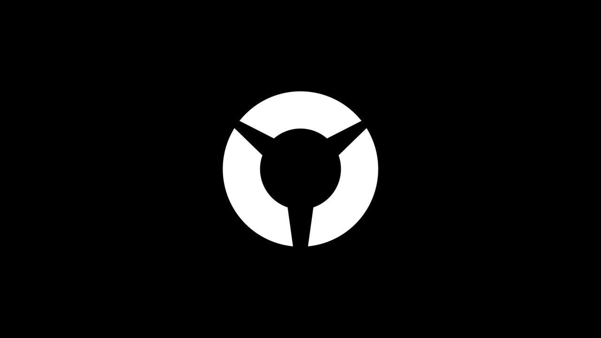

# plymouth-theme-legion

Inspired by discord logo of Laptop Wiki (Legion Community)

Available on AUR: [plymouth-theme-legion-git](https://aur.archlinux.org/packages/plymouth-theme-legion-git)

## Screenshots

Default Theme

Bootup:

Shutdown:

Default Legion Blue Theme

Bootup:

Shutdown:

## Contributing

If you want to modify the animation, you need the following packages: `blender`, `imagemagick`, `optipng`.

1. Open Blender and verify that the output is set to PNG and color is RGBA
2. Start animation rendering. Results placed in:
- `render` for the default theme
- `render-blue` for the blue varian
3. Run:
- `gen.sh` to generate theme files and gifs for the default theme
- `gen-blue.sh` to generate theme files and gifs for the default legion blue theme

